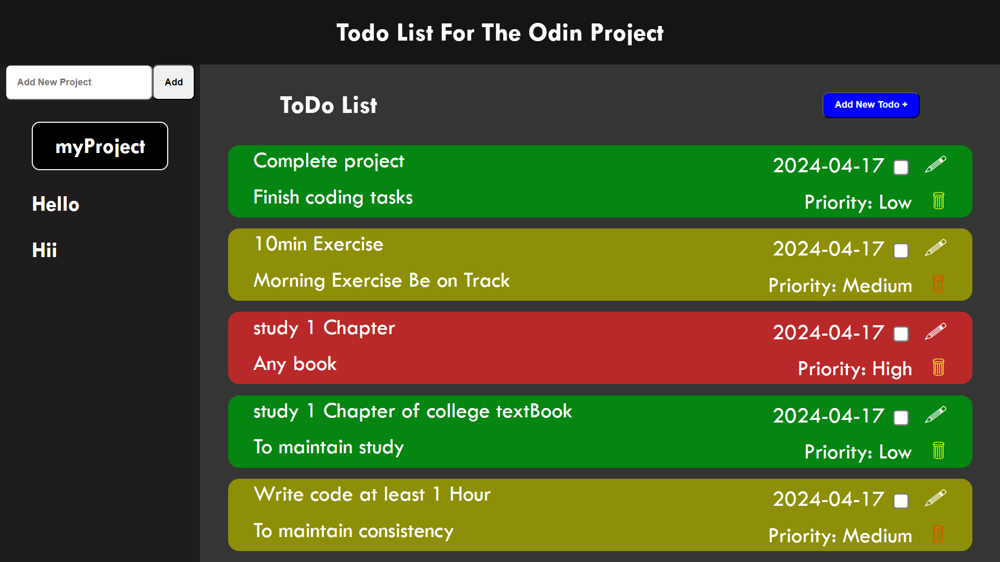

# Todo-List Project

[Live here](https://abhi6777.github.io/Todo-List/)

## Overview
This project is a todo-list application built using HTML, CSS, and JavaScript. It allows users to create projects and add todos to them, with the ability to update and delete todos as needed. The project utilizes local storage to persist data and prioritize todos based on their priority level.

## Functionality
- **Add Project**: Users can create new projects and assign names to them.
- **Add Todo**: Users can add todos to specific projects, providing details such as title, description, due date, and priority level.
- **Update Todo**: Users can modify existing todos, including their title, description, due date, and priority.
- **Delete Todo**: Users can remove todos from projects.
- **Local Storage**: Data is stored locally to ensure persistence across sessions.
- **Priority Color**: Todos are visually distinguished based on their priority level.

## Usage
To use the application click on the link :-
1. https://abhi6777.github.io/Todo-List/

## Getting Started
If you want to explore the project's codebase:
1. Clone the repository to your local machine.
2. Navigate to the project directory.
3. Open the project files in your preferred code editor.

## Contributing
If you wish to contribute to the project:
1. Fork the repository.
2. Create a new branch for your changes.
3. Make your modifications and commit them.
4. Push your branch to your forked repository.
5. Open a pull request to the main repository.

## Credits
- Created by Abhimanyu Mahto
